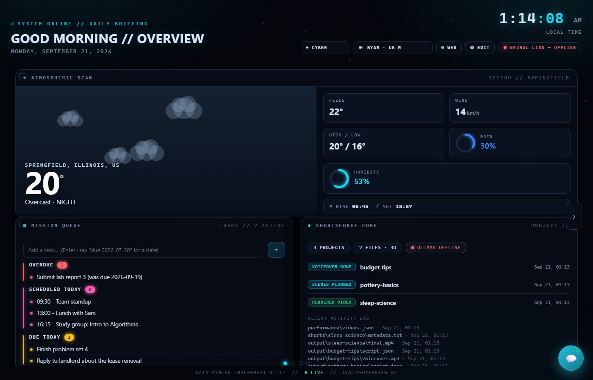
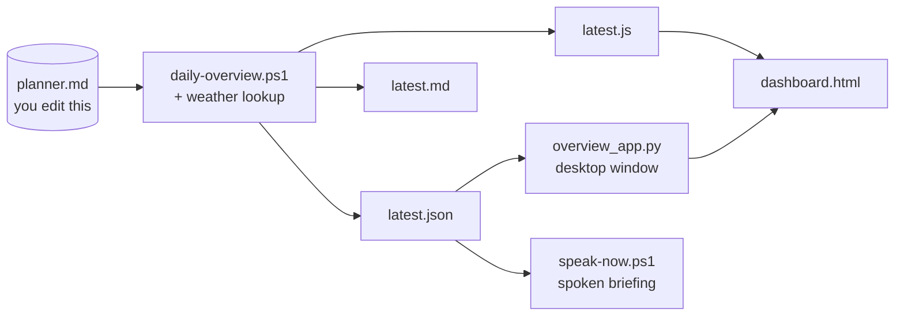

# Daily Overview

[](https://github.com/darkspaz-v1/daily-overview/actions/workflows/ci.yml)
[](LICENSE)

A Windows dashboard and voice briefing that turns one hand-edited markdown planner into today's weather, tasks, and schedule.

[Quick start](#quick-start) · [How it works](#how-it-works) · [Known limitations](#known-limitations) · [Privacy boundary](#privacy-boundary) · [Tests](#tests)



_The screenshot is the real `dashboard.html`, rendered from [`examples/planner.example.md`](examples/planner.example.md) and a
throwaway side-project folder. Every task, name and date is invented. The weather location is a fixed placeholder; the
forecast numbers come from the live open-meteo API._

## Quick start

Needs Windows with PowerShell 5.1+ and an internet connection for weather (without it the weather panel degrades
and the rest still works). Python is only needed for the desktop app and voice.

1. **Get the code and a planner.**
   ```powershell
   git clone https://github.com/darkspaz-v1/daily-overview.git
   cd daily-overview
   Copy-Item examples\planner.example.md planner.md   # edit the dates to today; it is your file from here on
   ```
2. **Generate today's data.**
   ```powershell
   powershell -ExecutionPolicy Bypass -File daily-overview.ps1 -Quiet
   ```
   This writes `latest.json`, `latest.md` and `latest.js` next to the script (plus a dated copy in `overviews\`).
3. **Open the dashboard.** Double-click `dashboard.html`. It needs no server.

Want the desktop app with the voice assistant instead? `pip install -r requirements.txt`, then run `.\run-app.ps1`
(or double-click `Daily Overview.cmd`). The app regenerates the data each time it starts.

## How it works



_Architecture diagram, not a screenshot._ `planner.md` is the only thing you edit. `daily-overview.ps1` reads it, adds a
weather forecast (IP geolocation via ipinfo.io, forecast from open-meteo) and project status, and writes three output
files. `dashboard.html` reads `latest.js`; `overview_app.py` hosts the same dashboard in a pywebview window and re-runs the
engine on launch; `speak-now.ps1` speaks the `summary` field of `latest.json`.

## Known limitations

- **Windows + PowerShell only.** The engine, launchers and voice pieces are PowerShell/Win32; there is no macOS or
  Linux path.
- **Weather location is IP-based, not GPS.** `daily-overview.ps1` geolocates from your public IP (ipinfo.io, falling
  back to ip-api.com), so the place name and forecast are only as accurate as that lookup — usually city-level, not
  precise.
- **Voice/speech is optional and platform-specific.** `speak-now.ps1` needs `edge-tts` (falls back to Windows SAPI
  via `System.Speech`, itself Windows-only) and is not required for the dashboard or the engine to work.
- **No mobile support.** `dashboard.html` is a desktop-oriented local file; there is no responsive mobile layout or
  packaged mobile app.

## Privacy boundary

This is a personal tool, so its real inputs never live in the public repo. These files are in `.gitignore` and stay on
your machine:

| Ignored file or folder | Why |
|---|---|
| `planner.md` | your real tasks and schedule |
| `class-deadlines.md`, `class-schedule.md`, `effort.md` | coursework schedule and effort estimates read by `sync-classes.ps1` and `plan-day.py` |
| `latest.json`, `latest.md`, `latest.js`, `overviews\` | generated output that embeds the data above plus a location-derived weather place name |
| `money\`, `ai-research\`, `opportunities.*` | output of the optional research scripts |
| `layout.json`, `logs\` | your dashboard layout and app logs |

Two things to know: weather works by looking up your approximate location from your IP address (ipinfo.io, falling back
to ip-api.com), so those services see your IP; and the docs media in this repo were generated from invented data only.

## The pieces

| File | Role |
|---|---|
| `daily-overview.ps1` | The engine. Pulls IP-geolocated weather (ipinfo.io + open-meteo), reads `planner.md`, emits `latest.md` / `latest.json` / `latest.js` |
| `dashboard.html` | GridStack drag/resize board with six themes and a floating chat popup |
| `overview_app.py` | pywebview desktop app around the same data |
| `sync-classes.ps1` | Rewrites a marked block in `planner.md` from `class-deadlines.md` |
| `plan-day.py` | Builds a day plan using per-deliverable estimates in `effort.md` |
| `speak-now.ps1` | Speaks the current briefing (edge-tts, falling back to SAPI) |
| `open-jarvis-ui.ps1` | Raises an existing app window instead of starting a second one |

A minimal `planner.md` has `## Recurring`, `## Scheduled` (`- 2026-01-31 09:30 Team standup`) and `## Tasks`
(`- [ ] Buy milk (due: 2026-02-01)`) sections. `plan-day.py` and `sync-classes.ps1` additionally expect the three class
files beside them; you create those yourself.

## Design decisions worth stating

**The engine writes three formats, not one.** `latest.json` for programs, `latest.md` for reading, and
`latest.js` so `dashboard.html` can load data with no server and no fetch — the dashboard opens from
the filesystem.

**`open-jarvis-ui.ps1` is a hand-rolled single-instance guard** because `overview_app.py` has none.
Launching blindly stacks a new pywebview window every time. It queries `Win32_Process` for an existing
instance and, if found, calls `SetForegroundWindow` — with `ShowWindow(SW_RESTORE)` **only** when
`IsIconic` is true, since unconditionally restoring an unfocused window would un-maximise it. If the
process exists but has no window handle yet it is still starting, so the script does nothing rather
than racing it with a second instance.

**"Is it running" and "does it have a window yet" are different questions.** Treating a zero window
handle as "not running" is what produces duplicate windows.

**Sync marker contract.** `sync-classes.ps1` only rewrites content **between its markers** inside the `## Scheduled`
section of `planner.md`. Hand-written items outside the markers are never touched, which is what makes it safe to
re-run.

## Configuration

Windows only: PowerShell, Win32 APIs, and SAPI voices. Nothing is tied to one machine. Paths resolve in
this order: environment variable, then PATH or next to the script, then a `%USERPROFILE%` default.

| Variable | Meaning | Default |
|---|---|---|
| `DAILY_OVERVIEW_PYTHON` | full path to the `python.exe` used by `run-app.ps1` and `speak-now.ps1` | `pythonw` on PATH, then `py -3` |
| `CLAUDE_CLI` | full path to `claude.cmd` for the weekly AI research | `claude.cmd` on PATH, then `%APPDATA%\npm\claude.cmd` |
| `SHORTSFORGE_DIR` | the ShortsForge project folder shown in the briefing | `%USERPROFILE%\AI Agents` |

The `.vbs` launchers find their `.ps1` next to themselves, so the folder can live anywhere.

## Tests

```
pip install -r requirements-dev.txt
python -m pytest
```

Tests run against fake planner and schedule fixtures written to a temp folder. They never touch a real
`planner.md`. CI runs ruff, pytest (Python 3.12 and 3.13) and PSScriptAnalyzer (errors only) on Windows.

## Troubleshooting

The desktop app runs under `pythonw`, so errors do not appear in a console. They are written to
`logs/daily-overview.log` (rotating, next to `overview_app.py`). The scheduled research scripts log to
`money\run.log` and `ai-research\run.log`.

## License

MIT — see [LICENSE](LICENSE).
